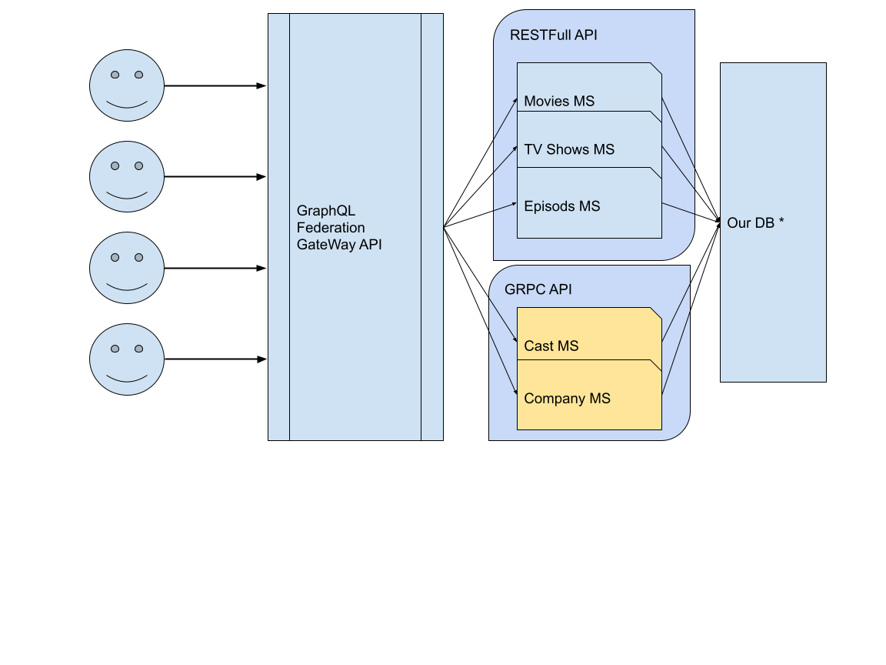
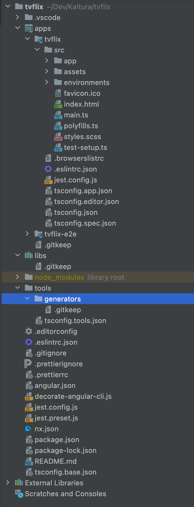

Это даже не статья а скорее мини врокшоп… Я хочу представить вашему вниманию маленькую аппликацию, но разработанную ка
энтерпрайз.

В 90% случаев, жизненный цикл новых аппликаций (как в стартапах так и в больших компаниях) состоит из следующих шагов.

Делаем POC, если работает - ищем деньги или берем апрув от начальства Из POC строим MVP, строим быстро…. Тут либо
доказать инвесторам либо начальству. Построили, и вроде работает, и даже сделали релиз на продакшн. Пошли клиенты…
Клиенты (ну или продакт) начали просить новые фишечки, да и баги начали появлятся… И тут начинается война в короткое
одеяло. Там починили тут поломалось, там добавили тут упало. А про перформанс вообще никто не говорит. И вот прошел год
полтора. Те кто начинали проект уже не в фирме. Новые программисты на большинство кода смотрят как на блак бокс. В итоге
все приходят к одной и той же развилке: рефакторить все, или строится с 0.

Мое мнение, строить с 0. И тут уже фирма выдает достаточно ресурсов/времени для того чтобы все обдумать. И создать
нормальную веб аппликацию уровня энтерпрайз.

В данной статье энтерпрайз аппликация это не апп для большой компании а апликация разработана в большой компании.
Например, “магазин амазон, нетфликс” это аппликация разработанная энтерпрайз. И вот о подобных аппликациях мы будем
говорить.

Энтерпрайз апп будем относить следующие критерии:

1) Минимум две группы разработчиков, а то и на много больше
2) Много функципнала и логики
3) Много разных вьюз или секций.
4) скейл критичен
5) 3рд сайд девелоперс експириенсе. Кто то может девелопить с нашими АПИ

**Определим фронт работ (SCOPE)**

Для нашего примера я решил использовать аппликацию похожую на ту над которой я работаю в Кальтуре.

Начнем с схематичного краткого описания:



Начнем с DB. Т.к. DB это не самая моя сильная сторона, то вместо организации некой базы данных в данном примере мы будем
использовать бесплатный API TMDB. Другими словами, наши микросервисы вместо базы данных будут обращаться во внешний API.

Следом идут микросервисы, которые разделены на два вида: REST и gRPC. Причина проста, показать пример работы с обоими
вариантами.

Затем GraphQl Federation, это отдельная история. Что это и с чем его едять я покажу на примере. Вместе с тем, советую
почитать пару статей (СТАТЬИ)

И завершает это все, а точнее с них все и начинается, это наши пользователи.

**Техническоя окружение (STACK):**

Вся разработка будет проходить в monorepo управляемой #nrwl.

- Клиентская часть Angular
- GraphQl: NestJS + Apollo
- Микросервиsы: NestJS.

**Начнем Шаг 1 - создадим наш проект.**

Название проекта в нашем примере будет ‘tvflix’

```
npx create-nx-workspace --preset=angular
```

Прийдется ответить на пару ворпосов:

```
✔ Workspace name (e.g., org name)     · tvflix
✔ Application name                    · tvflix
✔ Default stylesheet format           · scss
✔ Use Nx Cloud? (It's free and doesn't require registration.) · No
```

Пока все установится, можно пойти сделать чашечку кофе.

Открываем проект в любимом IDE:


На данный момент, все что у нас есть, это всего-лишь простая Angular App. аппликация. Можем запустить ее для проверки:

```
ng serve tvflix
```

Идем на localhost:4200…

**Наш первый API Service.**
Начнем с простого, Movies MS. это должен быть REST API. Создаем nestJs микросервис:

```
npm install -D @nrwl/nest
nx generate @nrwl/nest:application movies-ms
```

Идем в `apps/movies-ms`. Здесь наш новый микросервис. Запускаем:
`nx serve movies-ms` и идем на http://localhost:3333/api

Наш простой API готов :)
Напоминаю, что мы работаем в энтерпрайз и документация для нас крайне важна. Для удобства и на будущее (о нем позже)
добавим Swagger

```
npm install --save @nestjs/swagger swagger-ui-express
```

Меняем main.ts in movies-ms to:

```typescript
import { Logger } from '@nestjs/common';
import { NestFactory } from '@nestjs/core';

import { AppModule } from './app/app.module';
import { DocumentBuilder, SwaggerModule } from "@nestjs/swagger";

async function bootstrap() {
  const app = await NestFactory.create(AppModule);
  const globalPrefix = 'api';
  const config = new DocumentBuilder()
    .setTitle('Movies MS')
    .setDescription('RESTFull API for Movies Entities')
    .setVersion('1.0')
    .addTag('movies')
    .build();
  const document = SwaggerModule.createDocument(app, config);
  SwaggerModule.setup('api', app, document);

  const port = process.env.PORT || 3333;
  await app.listen(port);
  Logger.log(
    `🚀 Application is running on: http://localhost:${port}/${globalPrefix}`
  );
}

bootstrap();
```

Идем на http://localhost:3333/api/
И оппппа… у нас есть документация нашего микросервиса


